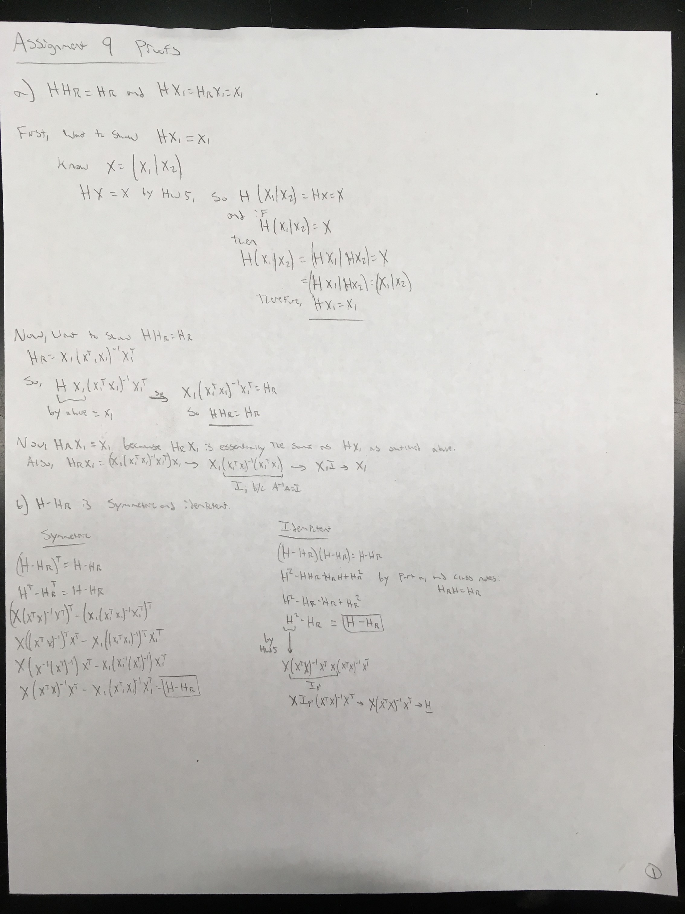
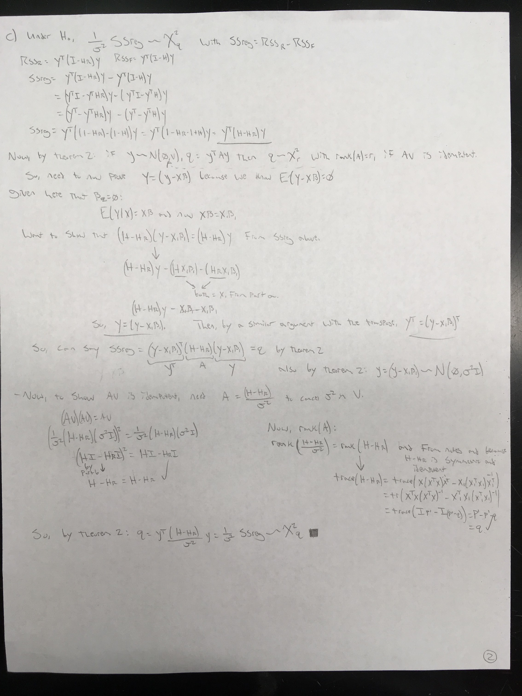
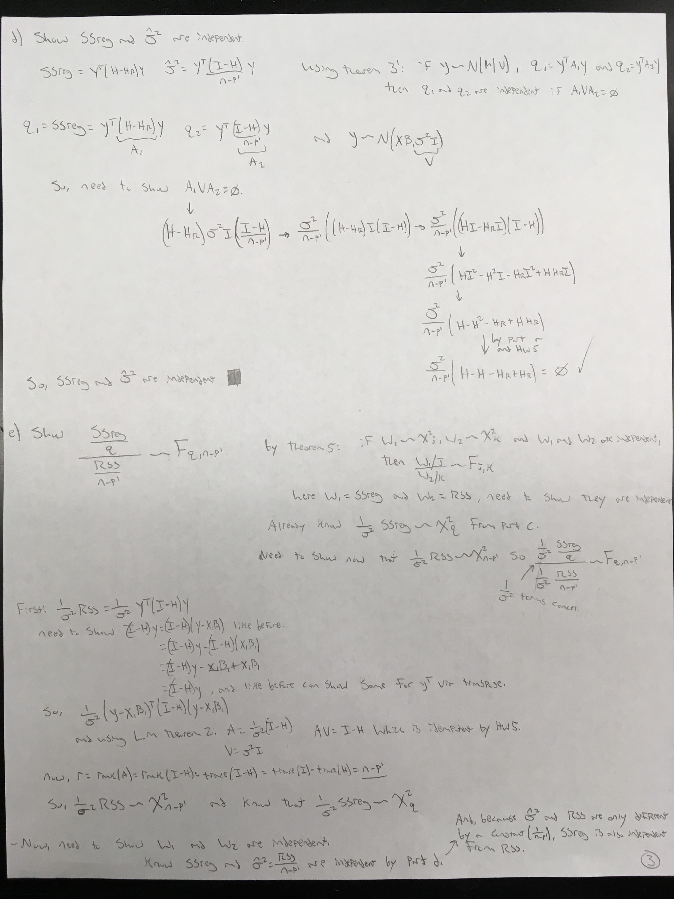

```{r setup, include=FALSE, message=FALSE, warning=FALSE, tidy=TRUE}
knitr::opts_chunk$set(echo = TRUE, message = FALSE, warning = FALSE, tidy = TRUE)
```

### 1. ALR 5.14:  Using the data file *BGSall*, consider the regression of *HT18* on *HT9* and the grouping factor *Sex.*

```{r}

rm(list=ls())

library(alr4)

Berkley <- BGSall

Berkley$sex <- ifelse(Berkley$Sex=="0","male","female")

```

#### 5.14.1: Draw the scatterplot of *HT18* versus *HT9*, using a different symbol for males and females. Comment on the information in the graph about an appropriate mean function for these data.

```{r}

scatterplot(HT18~HT9 | sex, data = Berkley, smooth=FALSE, boxplots=FALSE)

```

> From this plot, it seems pretty clear that there is real seperation between the male and female groups in terms of their height.  The intercepts of the two lines seem to be different, with the male one higher than the female one, but the slopes of the lines appear to be the same, or very close to the same.  Furthermore, there is also a clear relationship in both sexes, that as the height at age 9 increases, so too does the height at age 18.  This suggests to me that a proper mean function for these data will be one with the continuous *HT9* and the categorical *sex* as predictors, but no interaction.  So, it will be of the form: $HT18 ~ HT9 + sex$.


#### 5.14.2  Obtain the appropriate test for a parallel regression model.

```{r}

mpar <- lm(HT18 ~ HT9 + sex, data = Berkley)

summary(mpar)

```

> Looks good! Explains quite a bit of the variation, and the coefficients for both the continuous and categorical regressors are very significant.


#### Assuming the parallel regression model is adequate, estimate a 95% confidence interval for the difference between males and females. For the parallel regression model, this is the difference in the intercepts of the two groups.

```{r}

confint(mpar, level = 0.95)

```

> So, based on my previous model, we see here that we are 95% confident that the true coefficient obtained when we move the females to males, is within the interval of 10.528 to 12.864.  This means that we are 95% confident that the true increase in height seen in 18 year olds in this study is between 10.528 cm and 12.864 cm when we move from females to males.









### ALR 6.4

### 6.4: With the UN data, consider testing *NH: lifeExpF~log(ppgdp) + group:log(ppgdp)* *AH : lifeExpF~group + log(ppgdp) + group:log(ppgdp)* The AH model is the most general model given at (6.10), but the NH was not given previously.

```{r}

un <- UN11

m1 <- lm(lifeExpF ~ log(ppgdp) + group:log(ppgdp), data = un)
m2 <- lm(lifeExpF ~ group+log(ppgdp)+group:log(ppgdp), data = un)

```

#### 6.4.1: What is the meaning of the NH model?

> This NH model here is stating that the mean function is fully described by this first set of regressors, *log(ppgdp)* and the interaction between *group* and *log(ppgdp)*, and that there is no influence of the main effects from *group*.

#### 6.4.2 Perform the test and summarize the results

```{r}

anova(m1, m2)

```

> From this test, we can see that we got a p-value of about 0.06 when comparing the reduced (*m1*) and full (*m2*) models outlined above.  This means that, with an alpha of 0.05, we are unable to reject the null hypothesis that the mean function is fully described by the first reduced model, containing the regressors *log(ppgdp)* and the interaction *group:log(ppgdp)*.  So, we can't reject the hypothesis that the estimated coefficient associated with the main effect for *group* is equal to zero, meaning that regressor does not have an effect on lifeExpF when *log(ppgdp)* and *group:log(ppgdp)* are already present in the model.

> So, here we would (just barely with this p-value) conclude that the reduced null model is sufficient to explain the response, and that there is no need to include *group* in the model.

#### In addition, using the full model, perform the test $$ H_0 : \beta_{02} - \beta_{03} = 14~~and~~\beta_{12} + \beta_{13} =0.2$$ with $H_A :$ at least one equality doesn't hold.  Show your work.  In addition, how could you interpret this test?

```{r, tidy=TRUE, echo=FALSE, include=FALSE}

summary(m2)
# here beta_02 corresponds to groupother, beta_03 to groupafrica, beta_12 to groupother:log(ppgdp) and beta_13 to groupafrica:log(ppgdp)

# To compare level means like this, can use the formula outlined in section 5.1.2 and the corresponding code from class:

# first for beta_02 - beta_03 = 14
a=c(0,1,-1,0,0,0) 
# here we use 1,-1 in the vector a to correspond to beta_02 and beta_03, respectively.
se_b2b3=sqrt(t(a)%*%vcov(m2)%*%a)
b2b3=as.numeric(coef(m2)[2]-coef(m2)[3]) 
# so now have estimated difference between the two coefficients, and my standard error of the difference.
t_val=(b2b3-14)/se_b2b3 
# Now, to get the t-value I do my estimated value - the "true" difference of 14 that I am testing.
p_val=2*(1-pt(abs(t_val),m2$df))
c("test"="H0:b02-b03=14", "b02-b03"=b2b3,"SE"=se_b2b3,"t-Value"=t_val,"p-Value"=p_val)

# Now testing beta_12 + beta_13 = 0.2
a=c(0,0,0,0,1,1) 
# here we use 1, 1 in the vector a to correspond to beta_12 and beta_13, respectively.
se_b12b13=sqrt(t(a)%*%vcov(m2)%*%a)
b12b13=as.numeric(coef(m2)[5]+coef(m2)[6]) 
# so now have estimated sum of the two coefficients, and my standard error of that sum.
t_val2=(b12b13-0.2)/se_b12b13 
# Now, to get the t-value I do my estimated value - the "true" sum of 0.2 that I am testing against.
p_val2=2*(1-pt(abs(t_val2),m2$df))
c("test"="H0:b12-b13=0.2", "b12+b13"=b12b13,"SE"=se_b12b13,"t-Value"=t_val2,"p-Value"=p_val2)

```

```{r}

summary(m2)
# here beta_02 corresponds to groupother, beta_03 to groupafrica, beta_12 to groupother:log(ppgdp) and beta_13 to groupafrica:log(ppgdp)

# To compare level means like this, can use the corresponding code from class on 10.26.17:


L = matrix(c(0, 1, -1, 0, 0, 0,
             0, 0, 0, 0, 1, 1), 
           byrow=TRUE, nrow=2)


c.vector = c(14, 0.2)
ht3 = linearHypothesis(m2, hypothesis.matrix = L, rhs = c.vector)
ht3

```

> So, with this large p-value (F-value?) from the test performed above, I would interpret this as meaning that there is not enough support to reject the null hypothesis that both $\beta_{02} - \beta_{03} = 14~~and~~\beta_{12} + \beta_{13} =0.2$, and so it appears that both equalities hold.